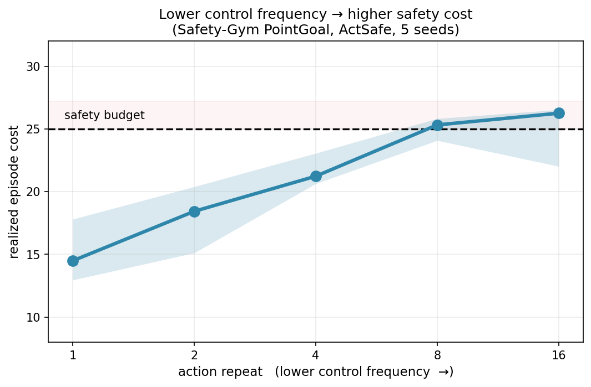

# Control-Frequency Safety on PointGoal — update (2026-06-29)

**One-line takeaway:** I tested the control-frequency safety hypothesis on the Safety-Gym PointGoal
benchmark, and it holds: with a *fixed* safe-RL agent (ActSafe, same algorithm / budget), the
incurred safety cost **rises as the control frequency drops, crossing the safety budget at low
frequency.** This is the motivating result for the time-adaptive method (TASE) I'm building next.

## The result

- Task: Safety-Gym **PointGoal** (`go_to_goal`), the ActSafe paper's home benchmark.
- Control frequency varied via **action repeat (AR)**: AR=1 = act every step (highest frequency),
  AR=16 = hold each action for 16 steps (lowest). Same 1000 physical steps per episode either way,
  so the realized episode cost is directly comparable to the budget **d = 25** at every frequency.
- 5 seeds per point; line = median, band = inter-quartile range.

**Cost rises monotonically as frequency drops and crosses the budget at AR=8.** Mechanism: a longer
open-loop hold is a *blind window* in which a developing violation can't be sensed or corrected — so
the safety margin erodes as the agent acts less often, and eventually breaks.

## Two points so it's not over-claimed

- **The agent is competently solving the task where it matters:** at AR=4 and AR=8 it reaches
  paper-level reward (~18–20), so the costs above come from a *capable* goal-reaching policy, not a
  do-nothing one. (AR=8 is the cleanest single result: a competent agent that nonetheless violates
  purely because of the slow control rate.)
- **Robust to the safety-margin setting:** the same rising trend appears at the no-margin pessimism
  setting (κ=0.001) as well as the modest-margin one (κ=0.1, shown), so it isn't an artifact of one
  hyperparameter choice.

## Next: TASE (Time-Adaptive Safe Exploration)

The fixed-frequency study above is the *motivation*. The proposed method lets the agent choose not
just *what* action but *how long* to hold it — picking a high control frequency only near hazards and
a low one elsewhere. The goal: recover high-frequency *safety* at a low *average* control cost,
beating every fixed frequency on the safety-performance frontier. Testbed wiring is in progress;
first TASE results to follow.
